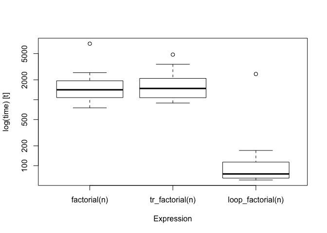
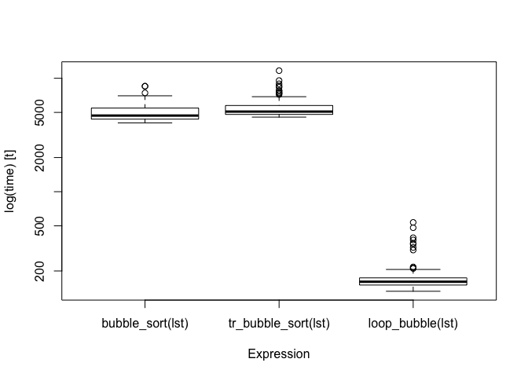

<!-- README.md is generated from README.Rmd. Please edit that file -->

# tailr – Tail recursion optimisations for R programming

[](https://www.gnu.org/licenses/gpl-3.0.en.html)
[](https://www.tidyverse.org/lifecycle/#maturing)
[](http://www.repostatus.org/#active)
[](/commits/master)
[](commits/master)
[](https://travis-ci.org/mailund/tailr)
[](https://ci.appveyor.com/project/mailund/tailr/branch/master)
[](https://codecov.io/github/mailund/tailr?branch=master)
[](https://coveralls.io/github/mailund/tailr?branch=master)
[](https://cran.r-project.org/package=tailr)
[](https://cran.r-project.org/package=tailr)
[](https://cran.r-project.org/)

Recursive functions are the natural way to express iterations in a
functional programming langauge, but in R, they can be significantly
slower than loop-versions and for moderately long sequences or
moderately deep trees, recursive functions will reach a limit imposted
on them by the stack limit.

There are known solutions to these problems, as long as functions are
written to be tail-recursive, meaning that the return value of a
function is either a base value or another recursive call, but where we
do not call recursively to then do something with the result.

The goal of `tailr` is to automatically transform tail-recursive
functions into loops or trampolines.

## Installation

You can install the released version of `tailr` from CRAN using

``` r
install.packages("tailr")
```

You can install tailr from GitHub with:

``` r
# install.packages("devtools")
devtools::install_github("mailund/tailr")
```

## Examples

Consider a classical recursive function, `factorial`:

``` r
factorial <- function(n) {
    if (n <= 1) 1
    else n * factorial(n - 1)
}
```

(I know R already has a builtin factorial function, but please ignore
that). This function will compute the factorial of `n`, but if `n` is
too large, it will exceed the stack limit:

``` r
> factorial(3000)
Error: C stack usage  7970184 is too close to the limit
```

A classical way out of this problem is to turn it into a tail-recursive
function:

``` r
factorial <- function(n, acc = 1) {
    if (n <= 1) acc
    else factorial(n - 1, acc * n)
}
```

R doesn’t implement the tail-recursion optimisation, though, so it
doesn’t help us.

``` r
> factorial(3000)
Error: C stack usage  7970184 is too close to the limit
```

With `tailr` we can, automatically, translate a tail-recursive function
into a looping one, essentially implementing the tail-recursion
optimisation this way.

``` r
tr_factorial <- tailr::loop_transform(factorial, byte_compile = FALSE)
```

I have disabled byte compilation to make running time comparisons fair
below; by default it is enabled. For a function as simple as
`factorial`, though, byte compiling will not affect the running time in
any substantial amount.

This version, because it looks instead of recurse, doesn’t have the
stack limit problem:

``` r
tr_factorial(3000)
#> [1] Inf
```

We get the result `Inf` because the number we compute is too large to
represent on the computer, but that is not the point of the example. The
point is that the recursion doesn’t get too deep for the stack because
we avoid recursion alltogether.

With something as simple as computing the factorial, it is easy to write
a looping function by hand, and it will be much faster than both the
(tail-)recursive and the transformed function:

``` r
loop_factorial <- function(n) {
    val <- 1
    while (n > 1) {
        val <- n * val
        n <- n - 1
    }
    val
}


n <- 1000
bm <- microbenchmark::microbenchmark(factorial(n), 
                                     tr_factorial(n), 
                                     loop_factorial(n))
bm
#> Unit: microseconds
#>               expr     min       lq      mean   median       uq      max
#>       factorial(n) 513.691 553.7360 692.20023 588.7665 688.9380 4537.763
#>    tr_factorial(n) 643.951 672.4245 749.39474 691.8510 729.9475 2066.655
#>  loop_factorial(n)  40.158  40.6975  67.22614  41.4170  42.7735 2485.322
#>  neval
#>    100
#>    100
#>    100
boxplot(bm)
```



The transformed version runs in about the same time as the recursive
one, but the looping function is much faster.

However, consider a more complicated example. Using the `pmatch`
package, we can create a linked list data structure as this:

``` r
library(pmatch)
llist := NIL | CONS(car, cdr : llist)
```

A natural way to process linked lists using pattern matching is to write
recursive functions that matches different patterns of their input. A
function for computing the length of a linked list can look like this:

``` r
llength <- function(llist, acc = 0) {
    cases(llist,
          NIL -> acc,
          CONS(car, cdr) -> llength(cdr, acc + 1))
}
```

``` r
tr_llength <- tailr::loop_transform(llength)
```

The function we generate is rather complicated

``` r
body(tr_llength)
#> .Primitive("{")(.tailr_llist <- llist, .tailr_acc <- acc, callCC(function(escape) {
#>     repeat {
#>         .Primitive("{")(llist <- .tailr_llist, acc <- .tailr_acc, 
#>             {
#>                 if (!rlang::is_null(..match_env <- pmatch::test_pattern(llist, 
#>                   NIL))) 
#>                   with(..match_env, escape(acc))
#>                 else if (!rlang::is_null(..match_env <- pmatch::test_pattern(llist, 
#>                   CONS(car, cdr)))) 
#>                   with(..match_env, {
#>                     .tailr_llist <<- cdr
#>                     .tailr_acc <<- acc + 1
#>                   })
#>             }, next)
#>     }
#> }))
```

but, then, it is not one we want to manually inspect in any case.

It is not too hard to implement this function with a loop either, but it
is not as simple as the recursive function:

``` r
is_nil <- function(llist) cases(llist, NIL -> TRUE, otherwise -> FALSE)
loop_llength <- function(llist) {
    len <- 0
    while (!is_nil(llist)) {
        len <- len + 1
        llist <- llist$cdr
    }
    len
}
```

If we compare the running time for these three functions, the
transformed function is faster than the recursive but not as fast as the
iterative:

``` r
make_llist <- function(n) {
    l <- NIL
    for (i in 1:n) {
        l <- CONS(i, l)
    }
    l
}
test_llist <- make_llist(100)
bm <- microbenchmark::microbenchmark(llength(test_llist),
                                     tr_llength(test_llist),
                                     loop_llength(test_llist))
bm
#> Unit: milliseconds
#>                      expr      min       lq     mean   median       uq
#>       llength(test_llist) 53.76697 58.99930 65.33068 61.43352 70.43616
#>    tr_llength(test_llist) 38.45880 40.90436 44.03367 42.38753 44.89655
#>  loop_llength(test_llist) 31.69172 34.17297 36.85065 35.24668 39.61324
#>        max neval
#>  143.49614   100
#>   62.86479   100
#>   49.27966   100
boxplot(bm)
```


As you have no doubt noticed about `llength`, it is not in fact
tail-recursive, from the look of it, since the final recursion is
enclosed by a call to `cases`. The function is only tail-recursive
because it can be translated into one by rewriting the `cases` function
call to a sequence of `if`-statements. The `tailr` package doesn’t
handle `cases` from `pmatch` by knowing about this package. Instead, it
has a mechanism that lets you provide re-writing rules.

If you set the attribute “tailr\_transform” on a function, and set this
attribute to a function, then that function will be called when `tailr`
sees the function, before it attempts any other processing. The
attribute must be a function that maps an expression to another,
re-written, expression. The one for `cases` looks like this:

``` r
tailr_transform_call <- function(expr) {
    stopifnot(rlang::call_name(expr) == "cases")

    args <- rlang::call_args(expr)
    value <- args[[1]]
    patterns <- args[-1]
    eval(rlang::expr(cases_expr(!!value, !!!patterns)))
}
attr(cases, "tailr_transform") <- tailr_transform_call
```

You can use this mechanism to support tail-recursion for
non-tail-recursive functions that can be rewritten to be tail-recursive.

More examples:

``` r
llcontains <- function(lst, x) {
    cases(lst, 
          NIL -> FALSE,
          CONS(car, cdr) -> if (car == x) TRUE else llcontains(cdr, x)
    )
}
tr_llcontains <- tailr::loop_transform(llcontains)

loop_contains <- function(lst, x) {
    while (!is_nil(lst)) {
        if (x == lst$car) return(TRUE)
        else lst <- lst$cdr
    }
}

lst <- make_llist(100)
bm <- microbenchmark::microbenchmark(llcontains(lst, 1001),
                                     tr_llcontains(lst, 1001),
                                     loop_contains(lst, 1001))
bm
#> Unit: milliseconds
#>                      expr      min       lq     mean   median       uq
#>     llcontains(lst, 1001) 57.39536 60.70168 64.48344 62.77156 64.79832
#>  tr_llcontains(lst, 1001) 39.28990 41.88991 43.20265 42.90343 44.30597
#>  loop_contains(lst, 1001) 32.09799 33.72188 35.15433 34.67652 36.43608
#>        max neval
#>  119.90418   100
#>   53.53174   100
#>   41.43686   100
boxplot(bm)
```


``` r
llrev <- function(llist, acc = NIL) {
    pmatch::cases(
        llist,
        NIL -> acc,
        CONS(car, cdr) -> llrev(cdr, CONS(car, acc))
    )
}

bubble <- function(llist, swapped = FALSE, acc = NIL) {
    cases(llist,
          CONS(first, CONS(second, rest)) -> 
              if (first > second) bubble(CONS(first, rest), TRUE, CONS(second, acc))
              else bubble(CONS(second, rest), swapped, CONS(first, acc)),
          CONS(x, NIL) -> list(new_list = llrev(CONS(x, acc)), swapped = swapped)
    )
}

bubble_sort <- function(lst) {
    if (is_nil(lst)) return(lst)
    bind[lst, swapped] <- bubble(lst)
    while (swapped) {
        bind[lst, swapped] <- bubble(lst)
    }
    lst
}

lst <- CONS(3, CONS(2, CONS(5, CONS(1, NIL))))
bubble_sort(lst)
#> CONS(car = 1, cdr = CONS(car = 2, cdr = CONS(car = 3, cdr = CONS(car = 5, cdr = NIL))))
```

``` r
tr_llrev <- function(llist, acc = NIL) {
    pmatch::cases(
        llist,
        NIL -> acc,
        CONS(car, cdr) -> llrev(cdr, CONS(car, acc))
    )
}
tr_llrev <- tailr::loop_transform(tr_llrev)

tr_bubble <- function(llist, swapped = FALSE, acc = NIL) {
    cases(llist,
          CONS(first, CONS(second, rest)) -> 
              if (first > second) tr_bubble(CONS(first, rest), TRUE, CONS(second, acc))
              else tr_bubble(CONS(second, rest), swapped, CONS(first, acc)),
          CONS(x, NIL) -> list(new_list = tr_llrev(CONS(x, acc)), swapped = swapped)
    )
}
tr_bubble <- tailr::loop_transform(tr_bubble)

tr_bubble_sort <- function(lst) {
    if (is_nil(lst)) return(lst)
    bind[lst, swapped] <- tr_bubble(lst)
    while (swapped) {
        bind[lst, swapped] <- tr_bubble(lst)
    }
    lst
}

lst <- CONS(3, CONS(2, CONS(5, CONS(1, NIL))))
tr_bubble_sort(lst)
#> CONS(car = 1, cdr = CONS(car = 2, cdr = CONS(car = 3, cdr = CONS(car = 5, cdr = NIL))))
```

``` r
loop_llrev <- function(lst) {
    acc <- NIL
    while (!is_nil(lst)) {
        acc <- CONS(lst$car, acc)
        lst <- lst$cdr
    }
    acc
}
loop_bubble <- function(lst, swapped = FALSE) {
    acc <- NIL
    repeat {
        if (is_nil(lst$cdr)) 
            return(list(new_list = loop_llrev(CONS(lst$car, acc)),
                        swapped = swapped))
        
        first <- lst$car
        second <- lst$cdr$car
        rest <- lst$cdr$cdr
        if (first > second) {
            acc <- CONS(second, acc)
            lst <- CONS(first, rest)
            swapped <- TRUE
        } else {
            acc <- CONS(first, acc)
            lst <- CONS(second, rest)
        }
    }
}

loop_bubble_sort <- function(lst) {
    if (is_nil(lst)) return(lst)
    bind[lst, swapped] <- loop_bubble(lst)
    while (swapped) {
        bind[lst, swapped] <- loop_bubble(lst)
    }
    lst
}

lst <- CONS(3, CONS(2, CONS(5, CONS(1, NIL))))
loop_bubble_sort(lst)
#> CONS(car = 1, cdr = CONS(car = 2, cdr = CONS(car = 3, cdr = CONS(car = 5, cdr = NIL))))
```

``` r
lst <- make_llist(10)
bm <- microbenchmark::microbenchmark(bubble_sort(lst),
                                     tr_bubble_sort(lst),
                                     loop_bubble(lst))
bm
#> Unit: milliseconds
#>                 expr        min        lq       mean     median        uq
#>     bubble_sort(lst) 145.075067 154.17486 157.796604 157.519846 160.66723
#>  tr_bubble_sort(lst) 124.090615 131.36796 134.359320 133.240386 135.12681
#>     loop_bubble(lst)   8.558761   9.19512   9.889474   9.600241  10.44961
#>        max neval
#>  198.65582   100
#>  181.74624   100
#>   15.54705   100
boxplot(bm)
```



The module primarily solves the problem of exceeding the stack space.
The transformed functions are not as fast as those we can code by hand
using loops. It *should* be possible to improve on the running time of
the transformed functions, however, with some program analysis… This
analysis should be included in the time usage analysis, though, which
will probably still come out saying that manually programmed looping
versions are faster than transformed functions. Recursive functions can
be a lot easier to read, though, than their corresponding looping
versions, especially with pattern matching.
