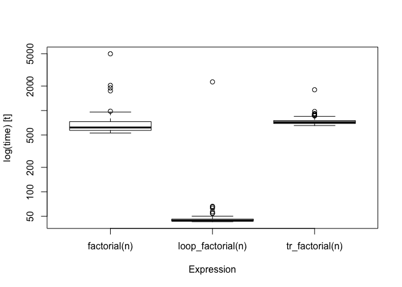
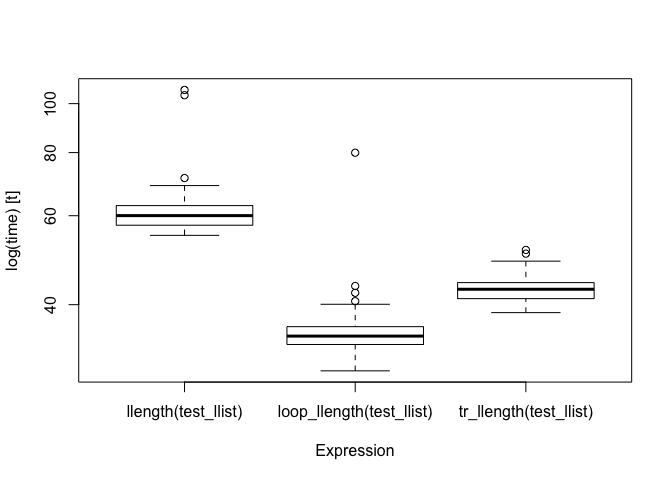

<!-- README.md is generated from README.Rmd. Please edit that file -->

# tailr – Tail recursion optimisations for R programming

[](http://www.repostatus.org/#active)
[](/commits/master)
[](https://www.tidyverse.org/lifecycle/#experimental)
[](https://www.gnu.org/licenses/gpl-3.0.en.html)

[](https://travis-ci.org/mailund/tailr)
[](https://ci.appveyor.com/project/mailund/tailr/branch/master)
[](https://codecov.io/github/mailund/tailr?branch=master)
[](https://coveralls.io/github/mailund/tailr?branch=master)

[](https://cran.r-project.org/)
[](commits/master)
<!--[](https://cran.r-project.org/package=tailr)
-->

-----

Recursive functions are the natural way to express iterations in a
functional programming langauge, but in R, they can be significantly
slower than loop-versions and for moderately long sequences or
moderately deep trees, recursive functions will reach a limit imposted
on them by the stack limit.

There are known solutions to these problems, as long as functions are
written to be tail-recursive, meaning that the return value of a
function is either a base value or another recursive call, but where we
do not call recursively to then do something with the result.

The goal of `tailr` is to automatically transform tail-recursive
functions into loops or trampolines.

## Installation

You can install tailr from GitHub with:

``` r
# install.packages("devtools")
devtools::install_github("mailund/tailr")
```

## Examples

We can take a classical recursive function and write it in a
tail-recursive form using an accumulator:

``` r
factorial <- function(n, acc = 1) {
    if (n <= 1) acc
    else factorial(n - 1, acc * n)
}
```

We can then, automatically, translate that into a looping version:

``` r
tr_factorial <- tailr::loop_transform(factorial)
tr_factorial
#> function (n, acc = 1) 
#> {
#>     .tailr_n <- n
#>     .tailr_acc <- acc
#>     callCC(function(escape) {
#>         repeat {
#>             n <- .tailr_n
#>             acc <- .tailr_acc
#>             if (n <= 1) 
#>                 escape(acc)
#>             else {
#>                 .tailr_n <<- n - 1
#>                 .tailr_acc <<- acc * n
#>             }
#>         }
#>     })
#> }

tr_factorial(100)
#> [1] 9.332622e+157
```

We can then compare the running time with the recursive function and a
version that is written using a loop:

``` r
loop_factorial <- function(n) {
    val <- 1
    while (n > 1) {
        val <- n * val
        n <- n - 1
    }
    val
}


n <- 1000
bm <- microbenchmark::microbenchmark(factorial(n), 
                                     loop_factorial(n), 
                                     tr_factorial(n))
bm
#> Unit: microseconds
#>               expr     min        lq      mean    median        uq
#>       factorial(n) 847.791 1030.0675 1376.1084 1175.6350 1463.7640
#>  loop_factorial(n)  61.760   64.9355  104.2284   67.3965   70.1890
#>    tr_factorial(n) 194.036  213.9335  270.4690  238.0405  287.6175
#>       max neval
#>  8944.642   100
#>  3074.322   100
#>   552.738   100
boxplot(bm)
```



There is *some* overhead in using the automatically translated version
over the hand-written, naturally, and for a simple function such as
`factorial`, it is not hard to write the loop-variant instead of the
recursive function.

However, consider a more complicated example. Using the `pmatch`
package, we can create a linked list data structure as this:

``` r
library(pmatch)
llist := NIL | CONS(car, cdr : llist)
```

A natural way to process linked lists using pattern matching is to write
recursive functions that matches different patterns of their input. A
function for computing the length of a linked list can look like this:

``` r
llength <- function(llist, acc = 0) {
    cases(llist,
          NIL -> acc,
          CONS(car, cdr) -> llength(cdr, acc + 1))
}
```

It is reasonably simple to understand this function, whereas a looping
version is somewhat more complicated. An initial attempt could look like
this:

``` r
loop_llength <- function(llist) {
    acc <- 0
    repeat {
        cases(llist,
              NIL -> return(acc),
              CONS(car, cdr) -> {
                  acc <- acc + 1
                  llist <- cdr
              })
    }
}
```

This version will not function, however, since it tries to `return` from
inside a call to `cases`, and `return` only works inside the immediate
scope.

Instead, we can use `callCC` to implement a non-local return like this:

``` r
loop_llength <- function(llist) {
    callCC(function(escape) {
        acc <- 0
        repeat {
            cases(llist,
                  NIL -> escape(acc),
                  CONS(car, cdr) -> {
                      acc <<- acc + 1
                      llist <<- cdr
                  })
        }    
    })
}
```

Notice that we have to use the `<<-` assignment operator here. This is
for the same reason that we need a non-local return. The expression
inside the call to `cases` is evaluated in a different environment than
the local function environment, so to get to the actual variables we
want to assign to, we need the non-local assignment operator.

It is possible to avoid `cases` using other functions from the `pmatch`
package, but the result is vastly more compliated since pattern matching
and expressions that should be evaluated per case needs to handle
scoping. We can automatically make such a function using `tailr`,
however:

``` r
tr_llength <- tailr::loop_transform(llength)
```

The function we generate is rather complicated

``` r
tr_llength
#> function (llist, acc = 0) 
#> {
#>     .tailr_llist <- llist
#>     .tailr_acc <- acc
#>     callCC(function(escape) {
#>         repeat {
#>             llist <- .tailr_llist
#>             acc <- .tailr_acc
#>             if (!rlang::is_null(..match_env <- test_pattern(llist, 
#>                 NIL))) 
#>                 with(..match_env, escape(acc))
#>             else if (!rlang::is_null(..match_env <- test_pattern(llist, 
#>                 CONS(car, cdr)))) 
#>                 with(..match_env, {
#>                   .tailr_llist <<- cdr
#>                   .tailr_acc <<- acc + 1
#>                 })
#>         }
#>     })
#> }
```

but, then, it is not one we want to manually inspect in any case.

The automatically generated function is complicated, but it actually
outcompetes the hand-written loop version.

``` r
make_llist <- function(n) {
    l <- NIL
    for (i in 1:n) {
        l <- CONS(i, l)
    }
    l
}
test_llist <- make_llist(100)
bm <- microbenchmark::microbenchmark(llength(test_llist),
                                     loop_llength(test_llist),
                                     tr_llength(test_llist))
bm
#> Unit: milliseconds
#>                      expr      min       lq     mean   median       uq
#>       llength(test_llist) 67.52501 83.05195 89.17195 87.66929 93.63144
#>  loop_llength(test_llist) 74.29022 86.94136 94.64089 90.70131 97.17110
#>    tr_llength(test_llist) 42.53179 50.94649 57.54708 56.66725 60.86652
#>       max neval
#>  154.7025   100
#>  196.3967   100
#>  145.5373   100
boxplot(bm)
```



It is, of course, possible to write a faster hand-written function to
deal with this case, but it will be about as complicated as the
automatically generated function, and you don’t really want to write
that by hand.
